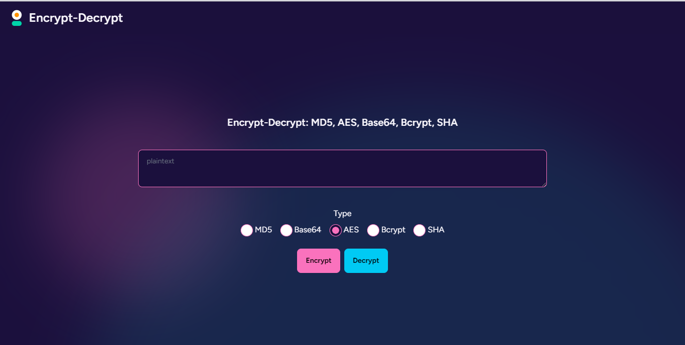

Terima kasih sudah menginformasikan! Berikut adalah beberapa penyesuaian README yang mencakup metode-metode enkripsi tersebut:

````markdown
# Aplikasi Encrypt Decrypt 🔒

Aplikasi Laravel untuk mengenkripsi dan mendekripsi teks menggunakan beberapa metode enkripsi populer: **MD5**, **AES**, **Bcrypt**, **SHA**, dan **Base64**. Aplikasi ini memungkinkan Anda untuk belajar dasar-dasar enkripsi di PHP dengan antarmuka yang sederhana.

## Fitur ✨

-   **Enkripsi dengan MD5, AES, Bcrypt, SHA, dan Base64**: Pilih metode enkripsi sesuai kebutuhan.
-   **Copy & Reset**: Tombol untuk mengosongkan input dan menyalin teks terenkripsi dengan mudah.
-   **Desain Responsif**: Dibangun dengan Tailwind CSS, antarmuka mendukung tampilan mobile.

## Tampilan Antarmuka



## Instalasi 🚀

1. **Clone repository**
    ```bash
    git clone <repository_url>
    cd <project_name>
    ```
````

2. **Install dependencies**

    ```bash
    composer install
    npm install && npm run dev
    ```

3. **Atur variabel lingkungan**
   Salin `.env.example` menjadi `.env` dan perbarui nilainya:

    ```plaintext
    APP_KEY=base64:generatedAppKey
    ```

    Lalu, buat application key:

    ```bash
    php artisan key:generate
    ```

4. **Setup database** (jika diperlukan)

    ```plaintext
    DB_CONNECTION=mysql
    DB_HOST=127.0.0.1
    DB_PORT=3306
    DB_DATABASE=nama_database
    DB_USERNAME=username_database
    DB_PASSWORD=password_database
    ```

    Jalankan migrasi:

    ```bash
    php artisan migrate
    ```

5. **Jalankan server**
    ```bash
    php artisan serve
    ```

## Cara Menggunakan 📝

1. **Buka aplikasi**: Kunjungi `http://localhost:8000` di browser.
2. **Masukkan Teks**: Tulis teks yang ingin Anda enkripsi atau dekripsi.
3. **Pilih Metode**: Tentukan metode enkripsi yang diinginkan (MD5, AES, Bcrypt, SHA, atau Base64).
4. **Encrypt / Decrypt**:
    - Klik **Encrypt** untuk mengenkripsi teks.
    - Klik **Decrypt** untuk mendekripsi teks kembali ke bentuk aslinya.
5. **Copy & Reset**:
    - Gunakan tombol **Copy** untuk menyimpan teks terenkripsi ke clipboard.
    - Gunakan tombol **Refresh** untuk mengosongkan semua field.

## Contoh Enkripsi AES & Base64

```plaintext
Input: Hello World
Terenkripsi (Base64): U2FsdGVkX1+KVRlcYxT2zg==
Didekripsi: Hello World
```

## Persyaratan 🛠️

-   PHP >= 7.4
-   Laravel >= 9.x
-   Ekstensi PHP OpenSSL
-   Composer
-   Node.js dan npm

## Lisensi 📄

Proyek ini open-source dan tersedia di bawah [Lisensi MIT](https://opensource.org/licenses/MIT).

```

Ini akan memastikan README Anda menunjukkan semua metode enkripsi yang digunakan dalam proyek, dan gambar tangkapan layar di `public/screenshots` akan ditampilkan dengan benar.
```
